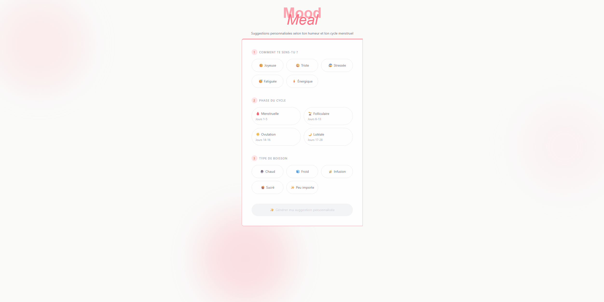

# MoodMeal <3

Application web qui génère des suggestions de boissons personnalisées en fonction de l'humeur, de la phase du cycle menstruel et des préférences de l'utilisatrice.

## 🛠️ Stack

**Frontend:** React, TypeScript, Tailwind CSS  
**Backend:** Spring Boot, Java 17
**IA:** Groq API (Llama)  
**DevOps:** Docker

## 🎯 Objectif du projet

Projet personnel développé dans le cadre de mon portfolio pour démontrer :
- Architecture full-stack moderne
- Intégration d'API IA
- Containerisation avec Docker
- Design UX/UI soigné
